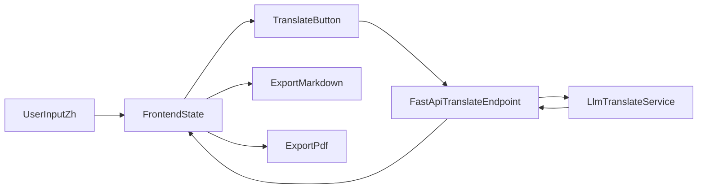

# 双栏中英编辑器实施计划

## 目标与范围

- 交付一个可本地运行的 Web 应用：左栏中文编辑、右栏英文编辑，双向独立可改。
- 支持“一键 LLM 翻译填充”：将中文内容翻译后写入英文栏（允许用户继续手改）。
- 支持导出：`MD`（双语内容）与 `PDF`（排版版面）。
- 首版不做账号系统、云存储、多人协作，先以单机本地文件下载为主。

## 技术路线（默认最简可行）

- 前端：`React + TypeScript + Vite`。
- 编辑器：`Monaco Editor`（或若依赖体积考虑可替换 `CodeMirror`）。
- 服务端：`FastAPI` 提供翻译接口（后续可切换任何 OpenAI 兼容模型服务）。
- PDF 导出：前端使用 `html2canvas + jsPDF`（实现快）；MD 导出直接生成文本文件下载。

## 项目结构（拟定）

- 前端入口：[frontend/package.json](frontend/package.json)
- 页面与编辑器：
  - [frontend/src/App.tsx](frontend/src/App.tsx)
  - [frontend/src/components/BilingualEditor.tsx](frontend/src/components/BilingualEditor.tsx)
  - [frontend/src/components/Toolbar.tsx](frontend/src/components/Toolbar.tsx)
- 导出能力：
  - [frontend/src/utils/exportMarkdown.ts](frontend/src/utils/exportMarkdown.ts)
  - [frontend/src/utils/exportPdf.ts](frontend/src/utils/exportPdf.ts)
- 后端入口与翻译：
  - [backend/app/main.py](backend/app/main.py)
  - [backend/app/routes/translate.py](backend/app/routes/translate.py)
  - [backend/app/services/llm_translate.py](backend/app/services/llm_translate.py)
- 配置与文档：
  - [backend/.env.example](backend/.env.example)
  - [README.md](README.md)

## 功能拆解与实施步骤

1. 搭建前后端基础工程

- 初始化前端 Vite 项目与后端 FastAPI 项目，配置本地联调（CORS + 代理）。
- 定义统一数据结构：`{ zhText, enText, updatedAt }`。

1. 实现双栏编辑核心

- 页面采用 2 栏布局：左中文、右英文，支持同步滚动（可选首版简化）。
- 两栏均可独立编辑，状态实时保存到内存（可加本地 `localStorage` 自动恢复）。

1. 实现翻译填充按钮

- 工具栏加入“LLM 翻译填充”按钮。
- 点击后调用后端 `/translate`：输入中文，返回英文并填入右栏。
- 提供错误反馈与重试（网络失败、Key 未配置、模型返回异常）。

1. 实现导出能力

- `导出 MD`：生成双语 Markdown（建议结构：中文段落 + 英文段落配对）。
- `导出 PDF`：将预览区域渲染为 PDF（A4，分页基础处理）。

1. 完善可用性与文档

- 增加最基本加载态、禁用态、错误提示。
- README 写明启动方式、环境变量、翻译模型配置、导出说明。

## 数据与流程图

## 里程碑与验收标准

- M1（基础可跑）
  - 前后端可启动；页面可见双栏编辑区。
- M2（翻译可用）
  - 点击按钮可将左栏中文翻译并写入右栏；失败时有提示。
- M3（导出可用）
  - 可下载 `*.md` 与 `*.pdf`；内容与页面一致。
- M4（可交付）
  - README 完整，首次拉起按文档可在 10 分钟内完成。

## 风险与预案

- LLM 接口不稳定或额度问题：
  - 预置 mock 翻译模式，保证无 Key 也能演示主流程。
- PDF 排版偏差：
  - 首版先保证内容正确导出，再迭代样式与分页精度。
- 编辑器性能（长文档）：
  - 首版以单文档为主，后续按需优化虚拟滚动与分块渲染。

